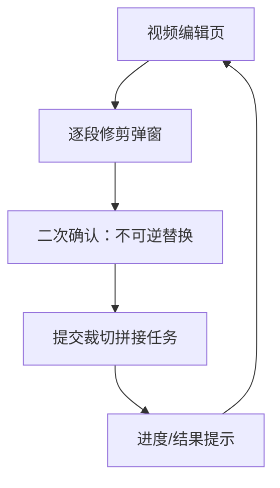

## 1. Product Overview
为单个视频提供“逐段修剪”弹窗：你可以在时间轴上选择多个保留/删除区间并预览播放。
点击确认后触发后端裁切+拼接，处理成功后**不可逆**地用新文件替换原始视频。

## 2. Core Features

### 2.1 Feature Module
本需求仅涉及以下核心页面：
1. **视频编辑页**：视频预览播放器、时间轴区间选择入口、修剪弹窗、处理进度与结果提示。

### 2.2 Page Details
| Page Name | Module Name | Feature description |
|-----------|-------------|---------------------|
| 视频编辑页 | 修剪入口 | 打开“逐段修剪”弹窗并传入当前视频信息（时长、帧率/时间基准、视频ID）。|
| 视频编辑页 | 逐段修剪弹窗-时间轴选择 | 选择并编辑多个区间：支持添加/拖拽调整起止点；支持区间去重/排序与边界校验（0~时长、start<end、最小间隔）。|
| 视频编辑页 | 逐段修剪弹窗-模式与区间列表 | 在“保留区间”与“删除区间”两种表达方式中二选一；列表展示所有区间并支持精确输入时间码、删除、禁用。|
| 视频编辑页 | 逐段修剪弹窗-预览播放 | 仅在区间范围内预览：支持播放/暂停、上一段/下一段、循环当前段；播放时在时间轴上同步光标。|
| 视频编辑页 | 逐段修剪弹窗-确认与不可逆提示 | 点击确认前强提示“将不可逆替换原文件”；二次确认后提交裁切任务；提交后禁用编辑控件避免重复提交。|
| 视频编辑页 | 后端处理进度 | 展示任务状态（排队/处理中/成功/失败）、百分比（如可得）、预计剩余时间（如可得）；支持取消/关闭弹窗但保持任务继续。|
| 视频编辑页 | 结果回写与刷新 | 成功后刷新播放器与时间轴以加载新视频文件；失败时展示错误原因与重试入口（保留当前区间配置）。|

## 3. Core Process
你在视频编辑页打开“逐段修剪”弹窗后，通过时间轴添加多个区间（保留或删除模式二选一）。你可以在弹窗中按区间预览播放并反复调整。当你点击“确认修剪”时，会弹出不可逆替换提示；二次确认后前端提交任务到后端。后端完成裁切与拼接后返回成功，前端自动刷新并用新视频替换原视频；若失败则显示原因并允许你在不丢失区间配置的情况下重试。

