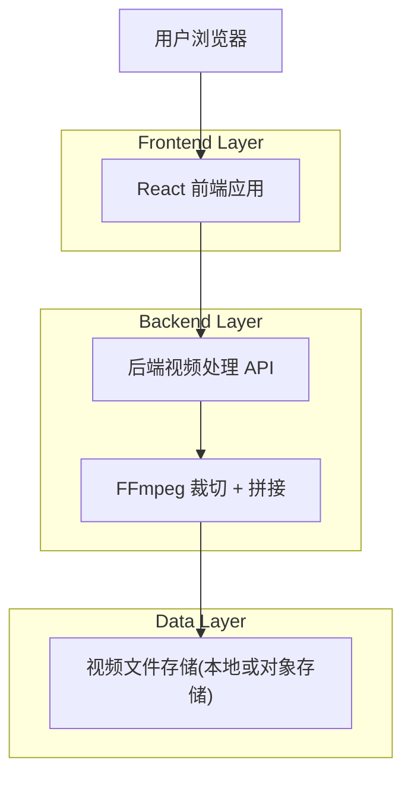
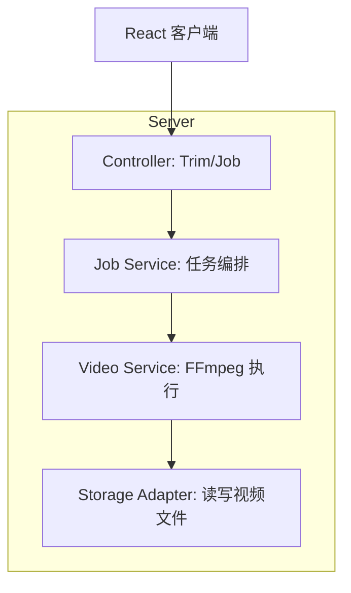

## 1.Architecture design


## 2.Technology Description
- Frontend: React@18 + TypeScript + vite + tailwindcss@3
- Backend: Node.js + TypeScript + Express(或 Fastify)
- Video Processing: FFmpeg（通过子进程调用）
- Database: None（MVP 可用内存任务表；如需跨进程/重启保留任务，再引入持久化）

## 3.Route definitions
| Route | Purpose |
|-------|---------|
| /videos/:videoId/edit | 视频编辑页，包含“逐段修剪”入口与处理状态展示 |

## 4.API definitions (If it includes backend services)

### 4.1 Core Types (TypeScript)
```ts
type TrimMode = "keep" | "delete";

type TimeRange = {
  startMs: number; // inclusive
  endMs: number;   // exclusive
};

type TrimRequest = {
  mode: TrimMode;
  ranges: TimeRange[]; // 多段
};

type JobStatus = "queued" | "processing" | "succeeded" | "failed";

type TrimJob = {
  jobId: string;
  videoId: string;
  status: JobStatus;
  progress?: number; // 0~1，可选
  errorMessage?: string;
  outputVersion?: string; // 用于前端刷新缓存/资源URL
};
```

### 4.2 Submit Trim Job
```
POST /api/videos/:videoId/trim
```
Request:
| Param Name| Param Type | isRequired | Description |
|-----------|------------|------------|-------------|
| mode | "keep" \| "delete" | true | 区间表达方式（二选一） |
| ranges | TimeRange[] | true | 多个区间（毫秒） |

Response:
| Param Name| Param Type | Description |
|-----------|------------|-------------|
| jobId | string | 任务ID，用于轮询/订阅进度 |

Example
```json
{
  "mode": "keep",
  "ranges": [
    {"startMs": 0, "endMs": 8300},
    {"startMs": 12000, "endMs": 21500}
  ]
}
```

### 4.3 Query Job Status
```
GET /api/jobs/:jobId
```
Response:
| Param Name| Param Type | Description |
|-----------|------------|-------------|
| jobId | string | 任务ID |
| status | JobStatus | 任务状态 |
| progress | number | 可选，0~1 |
| errorMessage | string | 可选，失败原因 |
| outputVersion | string | 可选，用于刷新播放器资源 |

## 5.Server architecture diagram (If it includes backend services)


## 6.Data model(if applicable)
（本需求 MVP 不强制引入数据库；若你需要任务可恢复与审计，再补充 jobs 表与视频版本表。）

### 关键实现约束（用于保证“不可逆替换”与一致性）
- 后端处理流程：读取原视频 -> 生成临时输出文件 -> 校验输出可播放/时长合理 -> **原子替换**（rename/move 覆盖或更新存储指针）-> 成功后删除原文件。
- 并发保护：同一 videoId 同时只允许一个 trim 任务在 processing（请求层加锁或任务队列去重）。
- 前端缓存刷新：成功后使用 outputVersion（或文件 URL 带查询参数）强制播放器重新拉取新文件。
